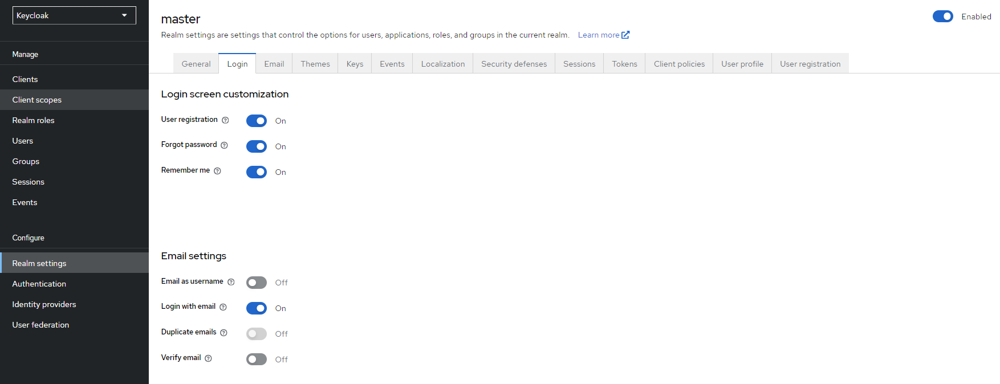
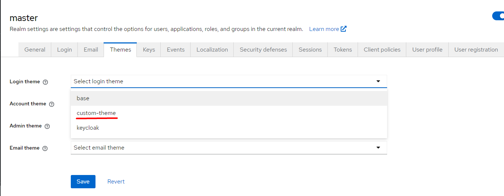
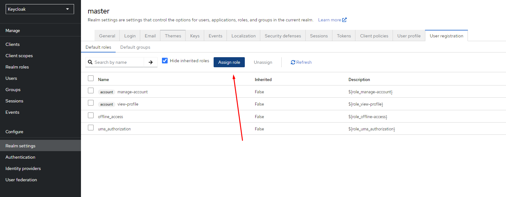
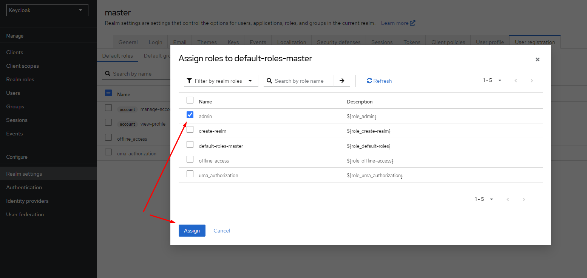
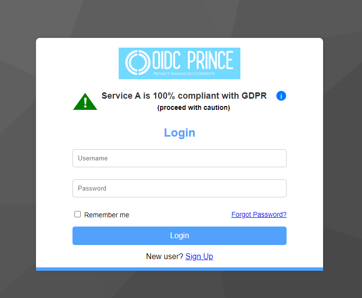
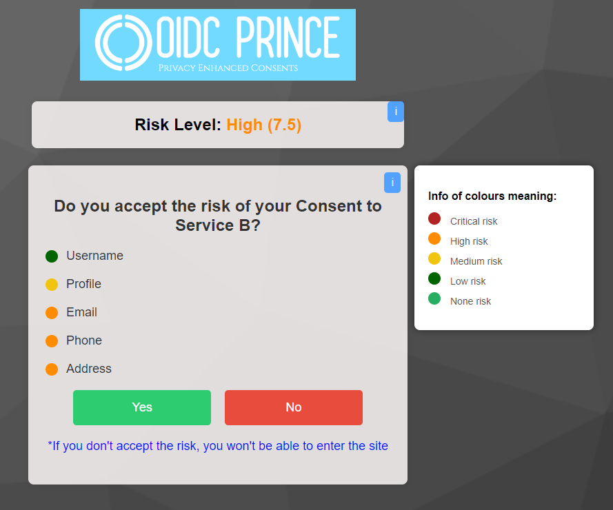

# oidc-keycloack-themes

OIDC theme for Keycloak Login

In this project the claims are generated and sent randomly by the [login.ftl](https://github.com/tiagogalvao7/OIDC-PRINCE-Keycloak/blob/main/themes/custom-theme/custom.v2/login/login.ftl) and [login-oauth-grant.ftl](https://github.com/tiagogalvao7/OIDC-PRINCE-Keycloak/blob/main/themes/custom-theme/custom.v2/login/login.ftl/login-oauth-grant.ftl) files so that you can see a greater diversity of results on the screens where the API calculation values are received (Login screen with GDPR Compliance, and the Grant Access screen with the risk associated with each claim), together with the [Flask-Client-Application](https://github.com/tiagogalvao7/Flask-Client-Application), you can test the entire implementation.

## Steps do test and use OIDC Login Keycloak theme

1. Clone the repository with ``git clone https://github.com/tiagogalvao7/OIDC-PRINCE-Keycloak``

2. run ``sudo docker-compose up --build``

After compile and run docker file, it's necessary to make some configurations in realm settings

Three screens were developed for our theme: Login screen, Create user screen and Grant Access screen.

## Login Page Theme

On this screen, we show the client's compliance with the GDPR (To obtain this value, a request is made to an API, which performs this calculation.). If the user doesn't know what GDPR is, we have a pop-up with a short explanation of what it is. If the compliance value is between 0-49% the warning signal will be colored red, between 50-69% will be colored orange, and between 70-100% will be colored green.
To customize this screen, you need to change the [login.ftl](https://github.com/tiagogalvao7/OIDC-PRINCE-Keycloak/blob/main/themes/custom-theme/custom.v2/login/login.ftl) file (it really needs to have this name, so that Keycloak knows that this screen is for the login screen), which has then been styled by [register.css](https://github.com/tiagogalvao7/OIDC-PRINCE-Keycloak/blob/main/themes/custom-theme/custom.v2/login/resources/css/style.css).
To perform this entire GDPR compliance assessment process, the script makes a request to the OpenID Connect configuration URL for the realm client (/.well-known/openid-configuration) to obtain the claims supported by the Keycloak for the specific client. It uses these claims to make a second request to the GDPR compliance API (/compliance/osp) to check the GDPR compliance level of the claims. In this project, the claims are randomly generated. Depending on the level of compliance (compliance percentage), the color of an alert triangle will change green for high, yellow for medium and red for low.

## Sign Up Page Theme

This is a simple screen where you just create a new user, but it has been slightly altered to fit in with the theme of our project. We had to change the [register.ftl](https://github.com/tiagogalvao7/OIDC-PRINCE-Keycloak/blob/main/themes/custom-theme/custom.v2/login/register.ftl) file, which has then been styled by [style_register.css](https://github.com/tiagogalvao7/OIDC-PRINCE-Keycloak/blob/main/themes/custom-theme/custom.v2/login/resources/css/style.css).

## Grant Access Page Theme

On this screen, the user is allowed to authorize or not the consent of the data to the client site. For our theme, some customizations have been made: two pop-ups with a color-coded risk legend have been added, as well as an explanation of the risk value by CVSS 4.0 (You can follow a link that explains what CVSS 4.0 is). The risk of claims is calculated through a request to an API, which calculates the risk of each claim for the type of client site being used to authenticate with Keycloak. In order to customize this screen, you need to change the [login-oauth-grant.ftl](https://github.com/tiagogalvao7/OIDC-PRINCE-Keycloak/blob/main/themes/custom-theme/custom.v2/login/login.ftl/login-oauth-grant.ftl) file (it really needs to have this name, so that Keycloak knows that this screen is for the grant access screen), which has then been styled by [style_grant.css](https://github.com/tiagogalvao7/OIDC-PRINCE-Keycloak/blob/main/themes/custom-theme/custom.v2/login/resources/css/style_grant.css). This page appears after the user creates an account, it can appear every time the user logs in to the client application, or just once after creating an account and logging in via Keycloak for the first time. These settings can be defined by the admin of the client application via Keycloak.

To allow you to preview the screens, three .html files are provided so that you can see how the themes look without having to use Keycloak.
